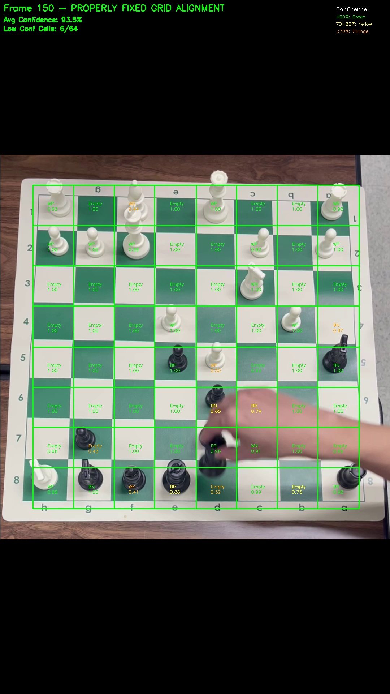
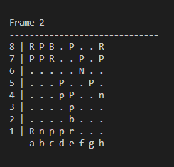
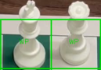
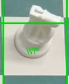

<p align="center">
  
</p>

<p align="center">
  <em>Example output frame from the video after board alignment and per-cell prediction.</em>
</p>

### Sample Text-Based Board Output (ASCII)
<p align="center">
  
</p>

<p align="center">
  <em>Example ASCII-based board state printed from the pipeline (Frame 2).</em>
</p>

# Chess Detection Technique Analysis
## Pipeline Overview

```
Video Frame → Board Detection → Perspective Warp → Inner Board Crop → Cell Extraction → CNN Prediction → Output
```
## Architecture Overview

  ### What Uses MobileNet vs Traditional Computer Vision

  | Stage | Method | Type |
  |-------|--------|------|
  | **Board Detection** | HSV, Canny, Hough | Traditional CV (logic code) |
  | **Perspective Warp** | Homography transform | Mathematical transformation |
  | **Inner Board Crop** | 8% margin calculation | Simple arithmetic |
  | **Grid Extraction** | `np.linspace(0, W, 9)` | Uniform division |
  | **Cell Classification** | **MobileNetV2** | **Deep Learning (CNN)** |

### Pipeline Flow

  ```
  ┌─────────────────────────────┐     ┌─────────────────────────────┐
  │   Traditional CV Pipeline   │     │   Deep Learning Pipeline    │
  ├─────────────────────────────┤     ├─────────────────────────────┤
  │                             │     │                             │
  │  1. Board Detection         │     │  5. Cell Classification     │
  │     (HSV, Hough, Canny)     │ ──► │     (MobileNetV2 CNN)       │
  │                             │     │                             │
  │  2. Perspective Warp        │     │  6. Feature Extraction      │
  │     (Homography)            │     │     (Learned features)      │
  │                             │     │                             │
  │  3. Inner Board Crop        │     │  7. 13-Class Prediction     │
  │     (8% margin)             │     │     (Empty + 12 pieces)     │
  │                             │     │                             │
  │  4. Grid Extraction         │     │                             │
  │     (64 cells, 96×96)       │     │                             │
  │                             │     │                             │
  └─────────────────────────────┘     └─────────────────────────────┘
  ```

  ### Feature Extraction

  The pipeline uses two types of features:

  1. **Traditional CV Features** (hand-crafted):
     - HSV color values for board detection
     - Canny edges for boundary detection
     - Hough lines for corner finding
     - Contours for shape analysis

  2. **Deep Features** (learned by MobileNet):
     - Automatically extracted from 96×96 cell images
     - Hierarchical representations learned during training
     - Used for piece type classification (13 classes)

  **Key Point:** MobileNet is **only** used for classifying the 64 extracted cells. All board detection, warping, and grid extraction use traditional computer vision techniques.

---

## Techniques Used

### Stage 1: Board Detection (`improved_board.py`)

**Multi-Strategy Auto Detection:**

| Strategy | Method | When Used |
|----------|--------|-----------|
| HSV Color Masking | Detects board by color (wooden, green tournament boards) | Primary |
| Edge + Hough Lines | CLAHE → Canny edges → Hough lines → Find intersections | Fallback 1 |
| Contour Detection | Multiple preprocessing → Find largest quadrilateral | Fallback 2 |
| Conservative Crop | 8% margin from edges | Final fallback |

### Stage 2: Perspective Warp

- **Homography Transformation**: `cv2.getPerspectiveTransform()` + `cv2.warpPerspective()`
- Transforms skewed board to 640×640 square
- Uses `INTER_LINEAR` interpolation

### Stage 3: Inner Board Crop (`detect_inner_board.py`)

- **8% margin** removal from each edge
- Removes border labels (a-h, 1-8)
- Ensures square output

### Stage 4: Cell Extraction (`grid_detector.py`)

- **Uniform 8×8 grid division** using `np.linspace()`
- Each cell resized to 96×96 pixels
- No line detection needed (board already warped)

### Stage 5: CNN Prediction

- **Model**: MobileNetV2 (pretrained ImageNet) + GlobalAveragePooling + Dense(13)
- **Input**: 96×96×3 RGB images
- **Output**: 13 classes (Empty, WP, WN, WB, WR, WQ, WK, BP, BN, BB, BR, BQ, BK)
- **Accuracy**: ~98.9% validation accuracy

---

## Advantages

| Advantage | Explanation |
|-----------|-------------|
| **Simple Architecture** | Just warp → split → classify. Easy to understand & debug |
| **Fast Inference** | Only 64 classifications vs scanning entire image |
| **Lightweight Model** | MobileNetV2 (9MB) works fine. No heavy YOLO needed |
| **Structured Output** | Always 8×8 grid → Easy FEN conversion |
| **Less Training Data** | Need cell images only, not bounding box annotations |
| **No Annotation Cost** | Labeling cells is easy (just class name). YOLO needs bounding boxes |
| **Board-Agnostic** | Works on any board color/style after warp |
| **Deterministic Grid** | Cell positions are fixed. No detection uncertainty |
| **Easy to Debug** | Can inspect each cell individually |
| **Good for Fixed Camera** | Perfect for overhead/consistent setups |

---

## Limitations

### The 3D Problem

Chess pieces have **height** (3D), but perspective warp assumes **2D plane**.

```
Camera View (angled):

     Queen top ──────► Appears shifted (wrong cell!)
         │
         │ (height)
         │
     Queen base ────► Correctly aligned (on board plane)
```

**Why it happens:**
- Perspective warp transforms the **board plane** (2D) correctly
- But chess pieces have **HEIGHT** (3D)
- Taller pieces (Queen, King, Rook) → tops appear in neighboring cells
- The effect is worse with angled cameras

#### Example: 3D height causing misalignment  
<p align="center">
  
</p>

<p align="center">
  
</p>

### Other Limitations

| Limitation | Impact |
|------------|--------|
| 3D piece height | Tall pieces overflow into adjacent cells |
| Angled cameras | Worse 3D distortion |
| Occlusion | Hand/pieces blocking view |
| Lighting changes | May affect board detection |
| Non-standard boards | May fail HSV detection |

---

## Comparison: Cell Classification vs YOLO

| Aspect | Cell Classification (This Project) | YOLO Object Detection |
|--------|-----------------------------------|----------------------|
| **Architecture** | Warp + Split + Classify | Single-shot detection |
| **Training data** | Easy (just cell images) | Hard (bounding boxes required) |
| **Model size** | ~9 MB (MobileNetV2) | ~50-200 MB |
| **Inference speed** | Fast | Medium |
| **3D handling** | Poor | Good |
| **Setup complexity** | Low | High |
| **Accuracy (overhead cam)** | Excellent | Excellent |
| **Accuracy (angled cam)** | Moderate | Good |
| **Output format** | Fixed 8×8 grid | Variable bounding boxes |
| **FEN conversion** | Easy (grid → FEN) | Complex (boxes → grid → FEN) |

---

## When to Use This Technique

**Good for:**
- Overhead or near-overhead camera angles
- Fixed camera setups
- Resource-constrained environments
- Quick prototyping
- When training data annotation is limited

**Consider alternatives (YOLO) when:**
- Camera angle is highly variable
- Tall pieces cause significant issues
- Maximum accuracy is required
- Resources are not constrained

---

## Directory Structure

```
Chess_Detection_Competition/
│
├── run_pipeline.py              # Main inference script
├── requirements.txt             # Dependencies
│
├── models/
│   ├── finetuned_model.h5       # Trained CNN (MobileNetV2)
│   ├── classes_finetuned.json   # 13 class mapping
│   └── training_history.json    # Training metrics
│
├── src/Chess_Detection_Competition/
│   ├── improved_board.py        # Board detection (HSV, Hough, Contours)
│   ├── detect_inner_board.py    # Inner board crop (8% margin)
│   ├── grid_detector.py         # Cell extraction (8×8 split)
│   ├── inference.py             # Inference utilities
│   └── ...                      # Other modules
│
├── data/                        # Test videos
└── output/                      # Generated outputs
```

---

## Usage

```bash
python -m venv .venv
.venv\Scripts\activate
pip install -r requirements.txt

py -3.12 -m venv .venv312
.\.venv312\Scripts\Activate.ps1
pip install -r requirements.txt

python run_pipeline.py
```

**Outputs:**
- `output/predictions.csv` - FEN notation per frame
- `output/annotated_video.mp4` - Video with predictions overlaid
- `output/images/` - Annotated frame images

### Sample Output Images

<p align="center">
  <a href="output/images/1 (2).png">
    
  </a>
</p>

<p align="center">
  <em>Example output image #1 — board alignment + piece prediction.</em>
</p>

<br>

<p align="center">
  <a href="output/images/2 (1).png">
    
  </a>
</p>

<p align="center">
  <em>Example output image #2 — grid cell extraction + per-cell CNN classification.</em>
</p>


